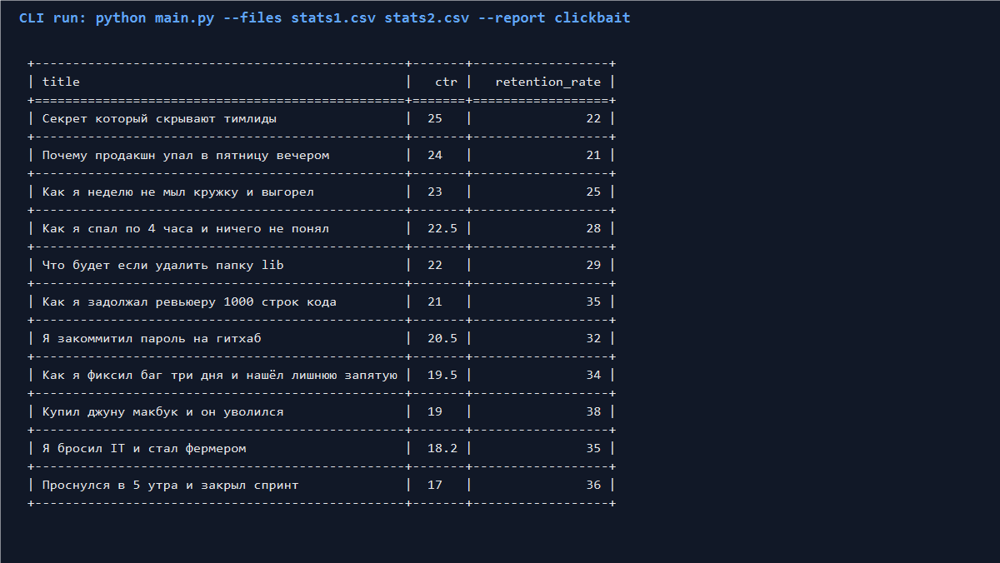

# YouTube Clickbait Report CLI

Консольное приложение читает один или несколько CSV-файлов с метриками видео YouTube и строит отчет `clickbait`.

В отчет попадают только видео, у которых одновременно:
- `ctr > 15`
- `retention_rate < 40`

Вывод в консоль в виде таблицы с колонками: `title`, `ctr`, `retention_rate`, отсортировано по убыванию `ctr`.

## Примеры запуска

Один CSV-файл:

```bash
python main.py --files stats1.csv --report clickbait
```

Несколько CSV-файлов:

```bash
python main.py --files stats1.csv stats2.csv --report clickbait
```

Пример ошибки (несуществующий отчет):

```bash
python main.py --files stats1.csv --report unknown-report
```

## Скриншот запуска



## Что важно для ревью

- Для чтения CSV и CLI используется стандартная библиотека (`csv`, `argparse`).
- Архитектура расширяемая: новый отчет добавляется отдельным классом и регистрируется в `ReportRegistry`.
- Обрабатываются ошибки пользователя: несуществующий отчет и несуществующие файлы.

## Тесты

```bash
pytest -v
```

## Docker (опционально)

```bash
docker build -t youtube-report .
docker run --rm -v ${PWD}:/app/data:ro youtube-report --files /app/data/stats1.csv /app/data/stats2.csv --report clickbait
```
